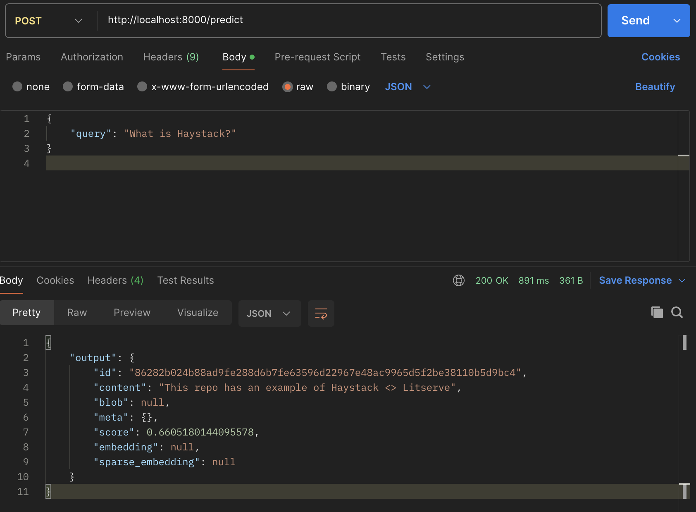

# Haystack <> Litserve
This repository is an integration example of Haystack and Litserve, showcasing how to deploy a server that processes natural language queries. We make use of Haystack for AI-Agentic Framework, Cohere for LLM & Embedding, and Litserve to serve the RAG model. 

## Initialize the Environment
Install UV: https://docs.astral.sh/uv/getting-started/installation/

`uv init`

## Switch to new virtual environment
`source .venv/bin/activate`

## Install dependencies
`uv sync`

## Run litserver server 
`uv run server.py`

Check out the docs in the form of Swagger UI at `http://localhost:8000/docs`.
Note: Considering `SERVER_PORT` variable at `constants.py` is not modified.

## Clients
### Python based
`uv run client.py --query "your_question"`
```json
Status: 200
Response:
 {"output":{"id":"86282b024b88ad9fe288d6b7fe63596d22967e48ac9965d5f2be38110b5d9bc4","content":"This repo has an example of Haystack <> Litserve","blob":null,"meta":{},"score":0.6605180144095578,"embedding":null,"sparse_embedding":null}}
```

### Postman



### CLI
```bash
curl --location 'http://localhost:8000/predict' \
--header 'Content-Type: application/json' \
--data '{
    "query": "What is Haystack?"
}
'
```

Output:
```json
{"output":{"id":"86282b024b88ad9fe288d6b7fe63596d22967e48ac9965d5f2be38110b5d9bc4","content":"This repo has an example of Haystack <> Litserve","blob":null,"meta":{},"score":0.6605180144095578,"embedding":null,"sparse_embedding":null}
```

## Docs
- Litserve: https://lightning.ai/docs/litserve/home
- Haystack: https://docs.haystack.deepset.ai/docs/intro
